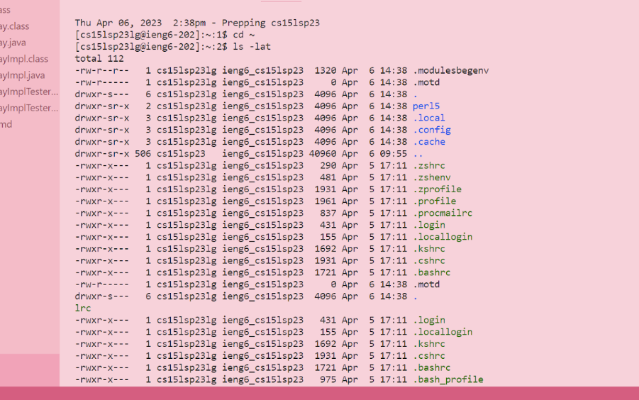

# Lab Report 1 - Week 1

Hello, are you in CSE15L? You will need to access your course-specific account.
This will be a tutorial on how to log into that.

**Step 2 - Looking Up Your CSE15L Account**

You will need to look up your course-specific account through this link:

[https://sdacs.ucsd.edu/~icc/index.php](https://sdacs.ucsd.edu/~icc/index.php)

**Step 1 - Installing Visual Studio Code**

You will need to install Visual Studio Code. Here is a link to install [https://code.visualstudio.com/] (https://code.visualstudio.com/). Once you have downloaded it, a screen like this should pop up.

**Step 2 - Remotely Connecting**

For Windows users, you will need to install Git for Windows and use the instructions in order to use bash.

[Download Git for Windows](https://gitforwindows.org/)
[Instructions for Using Bash on Windows](https://stackoverflow.com/a/50527994)

Once you have done that, open up a new terminal. To open the terminal, go to the top of the screen and click "Terminal", and then click "New Terminal".

A new terminal will be opened, and it will look like this.

In the terminal, enter the following, but replace zz with the letters from your course-specific account, and hit enter.

$ ssh cs15sp23zz@ieng6.ucsd.edu

You will then get a message asking if you want to continue connecting, type yes, and press enter.

Next, a prompt will come up asking for your password. Enter your password and press enter.

You will see this in the terminal. This means you computer is successfully connected to a computer in the CSE basement!

**Step 3 - Trying Some Commands**

Now that you are connected to the a CSE basement computer, you can try running some commands.

Here are some commands
* cd
* ls
* mkdir
* cp
* ls -lat
* ls -a
* cat

Note that not all of them may work. Below, I have listed the output of a few commands I have run.

Try some out on your own!

