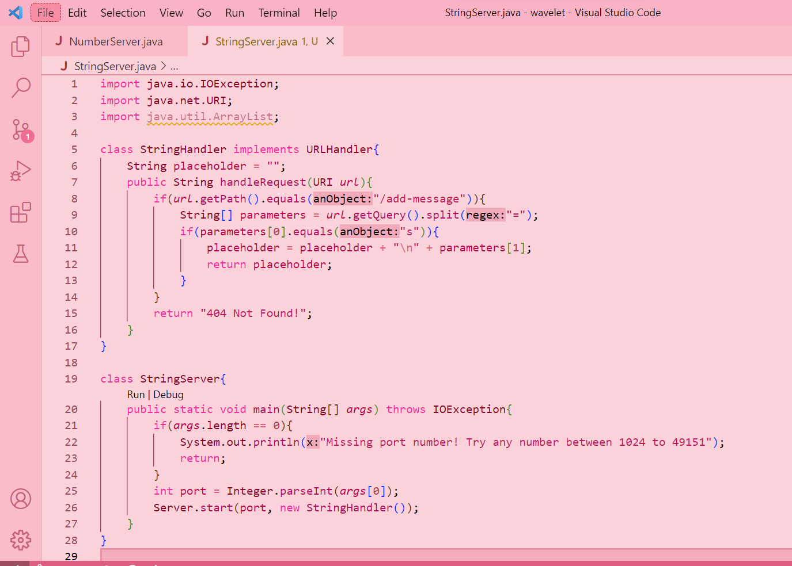
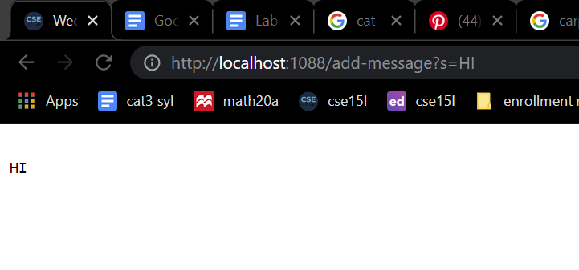
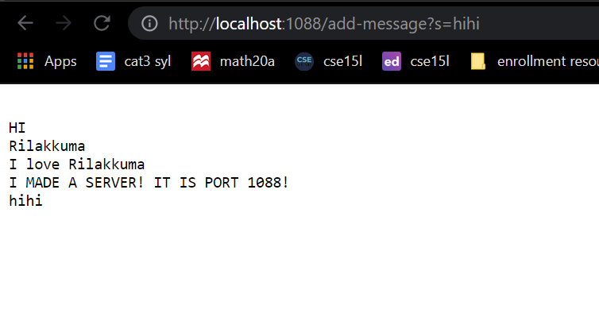
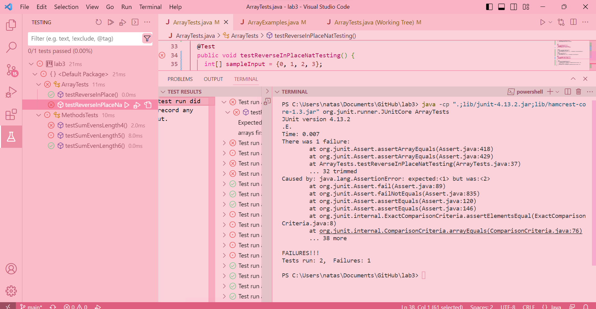
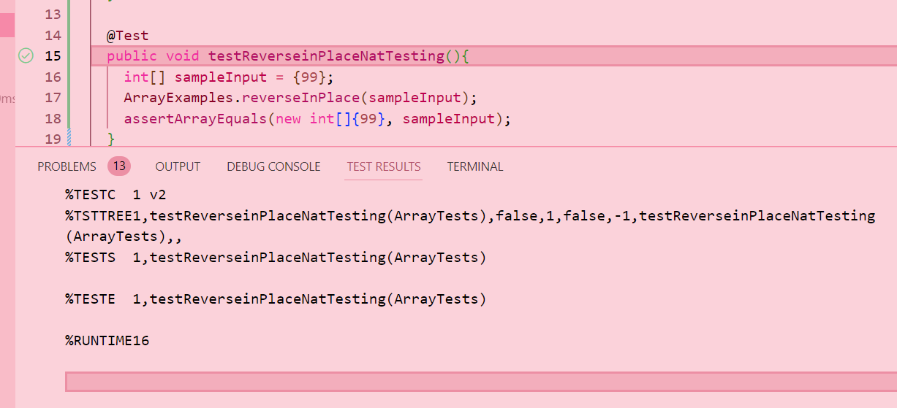

# Lab Report 2 - Week 4


Hello! Here is my Lab Report 2 - Servers and Bugs (Week 3)


**Part 1 - Web Server**




The methods in my code that are called are: handleRequest (This is called by the Server class to handle the requests to the URI)

The relevant arguments to those methods are: URI url (This is the requested URL, which has the information about the query parameters and the path of the URL.)
 
The relevant fields of the class are: String placeholder (This empty string stores the message when it is sent. New messages will continue to append into this placeholder.)

The values of placeholder changes depending on the requests made to the server. If the requested URL path matches /addMessage, and the query contains "s", the value of String placeholder is updated to include the message sent with the request. The additional requests that match this conditional will append the message in the request by storing it in placeholder. If the requested URL path does not match /addMessage or the query does not contain an "s", the placeholder will not change. Lastly, if the requested URL does not match any path that is valid, the server will return a "404 Not Found!" message.





**Step 2 - Bugs**

I will now be going over one of the bugs from lab 3.

The following refers to the reverseInPlace method.

Here is failure-inducing input:
```
@Test
public void testReverseinPlaceNatTesting(){
   int[] sampleInput = {0, 1, 2, 3};
   ArrayExamples.reverseInPlace(sampleInput);
   assertArrayEquals(new int[]{ 3, 2, 1, 0}, sampleInput);
}
```

Here is input that does not induce failure:

```
@Test
public void testReverseinPlaceNatTesting(){
    int[] sampleInput = {99};
    ArrayExamples.reverseInPlace(sampleInput);
    assertArrayEquals(new int[]{99}, sampleInput);
}
```


For the JUnit tests, here is what the two inputs output when the tests are run.

This is the output of the input that induces a failure



This is the output of the input that does not induce a failure:




Here is the bug:

This line attempts to swap elements at arr[i] with arr[arr.length - i - 1]. This will not work as it overwrites the original array values before the program can even swap them because of the for-loop.

```
  static void reverseInPlace(int[] arr) {
    for(int i = 0; i < arr.length; i += 1) {
      arr[i] = arr[arr.length - i - 1];
    }
  }
```


Here is the corrected code:

The line that is changed is for-loop and the assignment. The for-loop is changed to i < arr.length / 2 because of the iterations. In the first iteration, the second half of the array will be swapped. In the second iteration, the first half of the array will be swapped. We use the temp variable to store the original value of arr[i]. We will then use arr[arr.length-i-1] = temp to swap the values.

```
static void reverseInPlace(int[] arr) {
    for(int i = 0; i < arr.length/2; i += 1) {
      int temp = arr[i];
      arr[i] = arr[arr.length - i - 1];
      arr[arr.length-i-1] = temp;
    }
  }
```

**Part 3 - Something I Learned **

From the lab in week 3, I learned this a basic idea of testing: if my code passes the JUnit tests, that doesn't necessarily mean that my code is correct. The code is supposed to properly output whatever I input, and it must take care of any special edge cases. Another thing I have learned is that preciseness/accuracy is key to making my code successful. For example, in lab2, if I made slight adjustments to the server code, like capitalizing "S" in the contains method, then the code won't work and I would not be able to create a server.
