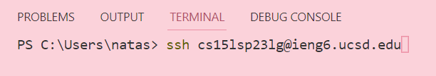
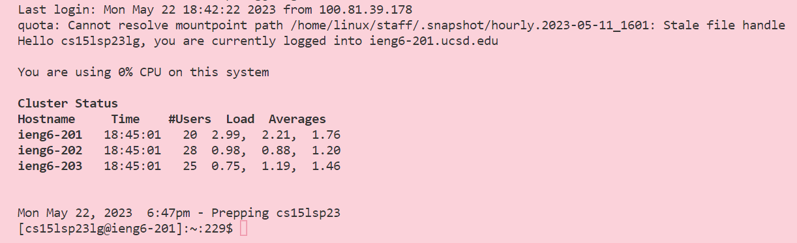
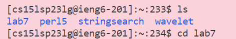
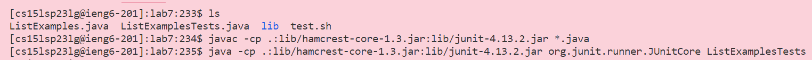
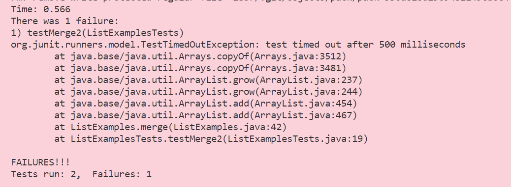
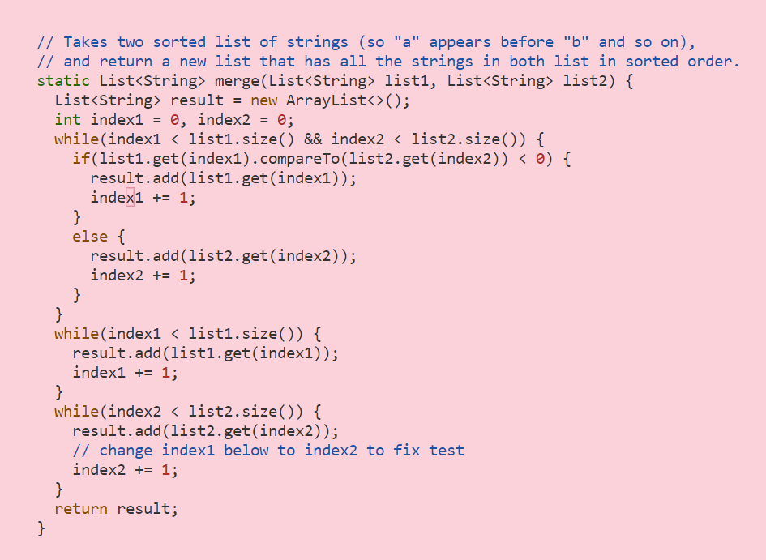
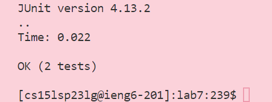

# Lab Report 4 - Week 7

Hello! Here is my Lab Report 4.

**Step 1 - Logging Into ieng6 Account**

From week 7's lab tasks, I didn't need to enter my password after I logged in. Once I typed in `$ ssh cs15lsp23lg@ieng6.ucsd.edu` into the terminal, I just hit `<enter>` and I was already logged in.

Output - 

**Step 2 - Cloning the Repository**

Since the command for cloning the repository was already in my history, I pressed <up> ten times and then hit <enter>.

Keys pressed: `<up> <up> <up> <up> <up> <up> <up> <up> <up> <up> <enter>`

  
  
  
  

**Step 3 - Running the Tests to See Failure**

In order to run the tests, I had to first enter the directory for the file. I typed  `ls` and then hit `<enter>`, and then typed `cd lab7` and then hit `<enter>`.

Keys pressed:
`<ls> <enter>` (This lists the files and directories in a directory)
`<cd lab7> <enter>` (The `cd` command changes directory. I used this to change the directory to lab7) 

  
  
  
  
  

Next, to run the tests, I typed `<ls>` into the terminal, then hit `<enter>`. After that, I pasted the `javac` and `java` commands using right click and then hitting `<enter>` for each of those commands.

Keys pressed:
`<ls> <enter>` (This lists the files and directories in a directory)
`<left click> <enter>` (For `javac -cp .:lib/hamcrest-core-1.3.jar:lib/junit-4.13.2.jar *.java`. `javac` compiles all of the code.)
`<left click> <enter>` (For `java -cp .:lib/hamcrest-core-1.3.jar:lib/junit-4.13.2.jar org.junit.runner.JUnitCore ListExamplesTests`. `javac` executes the code.)
  
  
  
  

Output: Here, we see that the test is failing.

**Step 3 - Edit the Code File to Fix the Failing Test**

In order to edit the code, I will need to use VIM. I typed `<vim> <ListExamples.java>` and then pressed `<enter>`. Then, I pressed `<k>` four times to move up (since my cursor was already near the bottom of the file). Next, I pressed `<l>` eleven times to move right. Now my cursor was one character after the number 1. I then pressed `<i>`
to be able to enter text. I pressed `<backspace>` to delete the number 1, and then typed `<2>` to replace the number 1 with 2.

Keys pressed:
`<vim> <ListExamples.java> <enter>` (The VIM command allows me to edit text of ListExamples.java)
`<k> <k> <k> <k> <k>`(To move cursor up)
`<l> <l> <l> <l> <l> <l> <l> <l> <l> <l>` (To move right)
`<i> <backspace> <2>` ( `<i>` allows me to edit text, then I deleted 1 and typed two in its place)

Output: Here is what the code looks like after I edited the text. Note that not all the code is shown, because all of the code could not fit into one screenshot.

**Step 4 - Run the Tests, Demonstrating that they Now Succeed**

I had to save the changes I made in step 3. To save the changes I made to the edited file, I pressed `<esc>` to exit out of edit mode, and then typed `<:wq>` to save the changes.

Keys pressed:
`<esc>` (Exits out of edit mode)
`<:wq>` (Saves changes to ListExamples.java)
  
Next, I will compile and execute the code. I used tab to go autofill the `java` and `javac` commands.
  
Keys pressed:
`<tab> <tab> <tab> <enter>` (For `javac -cp .:lib/hamcrest-core-1.3.jar:lib/junit-4.13.2.jar *.java`. `javac` compiles all of the code.)
`<tab> <tab> <tab> <enter>` (For `java -cp .:lib/hamcrest-core-1.3.jar:lib/junit-4.13.2.jar org.junit.runner.JUnitCore ListExamplesTests`. `javac` executes the code.)

  
  
  
 
Output: This output shows that the tests are now passing.

  
  
  
  
 **Step 5 - Commit and push the resulting change to your Github account (you can pick any commit message!)**

I typed `<git add ListExamples.java>` to add the files/changes to the repository. Then to commit, I typed `<git commit -m 'Initial Commit'> `. To push, I typed `<git push -u origin main>` to finally push the changes.
  
Keys pressed:
`<git add ListExamples.java>` (To add the files/changes to the repository)
`<git commit -m 'Initial Commit'> ` (To commit to the repository)
`<git push -u origin main>` (To push the changes)

  

  

