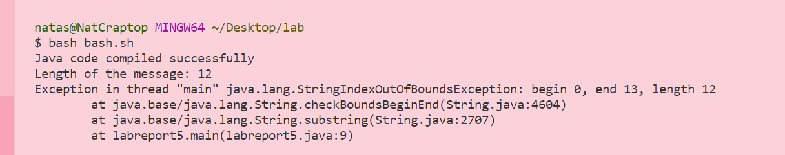
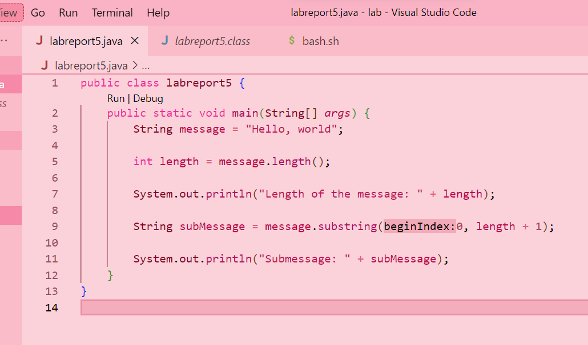
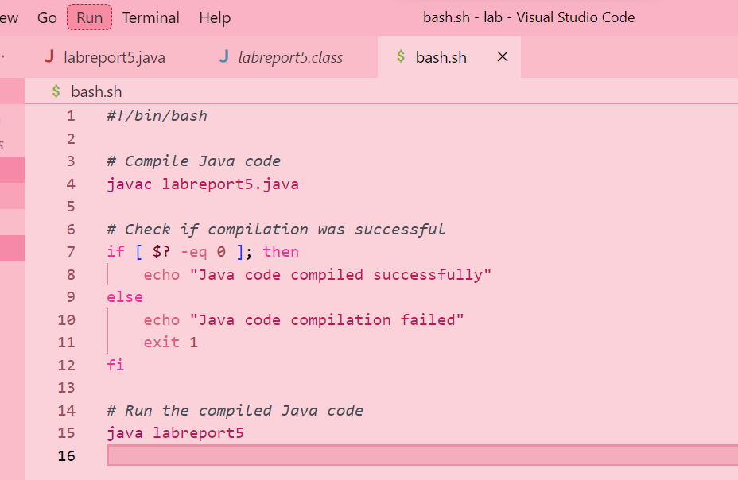
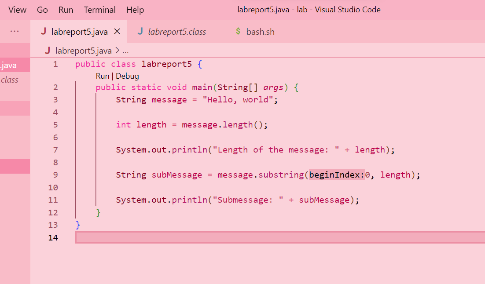
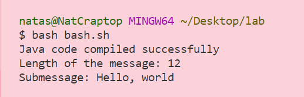
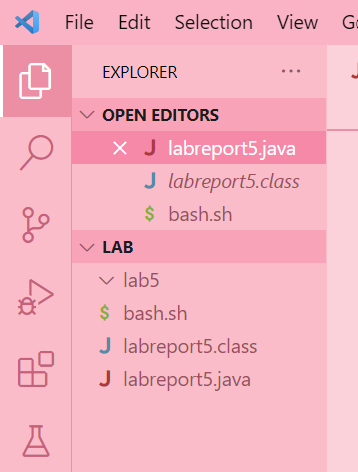

# Lab Report 5 - Week 9


Hello! Here is my Lab Report 5 - Debugging (by Natasha Tran).


# Part 1 - Debugging Scenario

**EdStem Post**

**What environment are you using(computer, operating system, web browser, terminal/editor, and so on)?**

I am using a Windows 11 laptop and I am on Visual Studio Code.

**Detail the symptom you're seeing, be specific include both what you're seeing and what you expected to see instead. Screenshots are great, copy-pasted terminal output is also
great. Avoid saying "it doesn't work'**

When I run my bash script `bash.sh` (which I just type `$ bash bash.sh`, which compiles the `labreport5.java` and checks if it's compiling, I get this error.



Here is my `labreport5.java` file.



Here is my `bash.sh` file.



**Detail the symptom you're seeing, be specific include both what you're seeing and what you expected to see instead. Screenshots are great, copy-pasted terminal output is also
great. Avoid saying "it doesn't work'**

The error looks like the substring is IndexOutOfBounds, but the bash script says it's compiling. I'm not sure where I'm going wrong.

**1) A response from a TA asking a leading question or suggesting a command to try**

What do you understand about substrings? When you call substring(x, y), x is an inclusive index and y is an exclusive index.

Can you try thinking about why exactly your substring would lead to an out of bounds error? Hint: your y is off.

**2) Another screenshot/terminal output showing what information the student got from trying that, and a clear description of what the bug is.**


 


**3) At the end, all the information needed about the setup including**

* The file & directory structure needed*




I made a folder called `lab`, and in it, I have `labreport5.java` and `bash.sh`.

* The contents of each file before fixing the bug

This is what `labreport5.java` looked like before fixing the bug.

```
public class labreport5 {
    public static void main(String[] args) {
        String message = "Hello, world";
        
        int length = message.length();
        
        System.out.println("Length of the message: " + length + 1);
        
        String subMessage = message.substring(0, length);
        
        System.out.println("Submessage: " + subMessage);
    }
}
```

This is what `bash.sh` looked like. This file will not change after fixing the bug, because the bug is in `labreport5.java`. This bash script only checks if the `labreport5.java` compiled.

```
#!/bin/bash

# Compile Java code
javac labreport5.java

# Check if compilation was successful
if [ $? -eq 0 ]; then
    echo "Java code compiled successfully"
else
    echo "Java code compilation failed"
    exit 1
fi

# Run the compiled Java code
java labreport5
```

* The full command line (or lines) you ran to trigger the bug

`bash bash.sh` would trigger the bug, which would show the `java.lang.StringIndexOutOfBoundsException` bug.

* A description of what to edit to fix the bug

To fix the bug, change line 9 of `labreport5.java` to be `(0, length)`, instead of `(0, length + 1)`. If it is `length + 1`, that means that the substring goes out of bounds for the string `"Hello, World!`, which has length 13 characters. Since the ending index is exclusive, doing `length + 1`, which is 14, would make it out of bounds as the last index of the string is index 12. 

It should look like this now.

```
public class labreport5 {
    public static void main(String[] args) {
        String message = "Hello, world";
        
        int length = message.length();
        
        System.out.println("Length of the message: " + length);
        
        String subMessage = message.substring(0, length);
        
        System.out.println("Submessage: " + subMessage);
    }
}
```

# Part 2 - Reflection

Something from the lab that I didn't know before was VIM. I did not know about VIM and it's uses, but I think it is cool. VIM is very different as it is a text editor. I didn't know about how it navigates using the k (up), j (down), h (left), and l (right) keys. I now see VIM memes on my Instagram explore page, and now I can finally relate to them.
